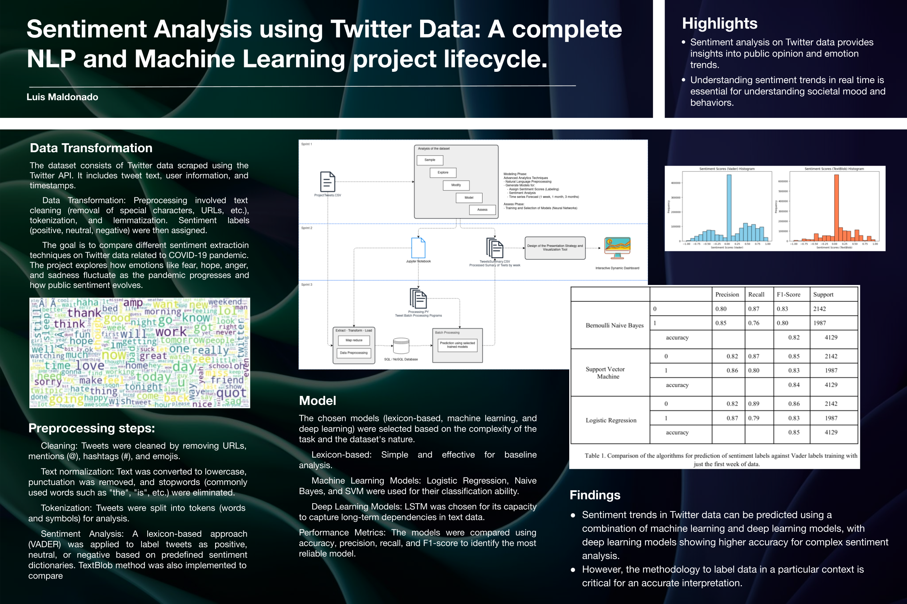
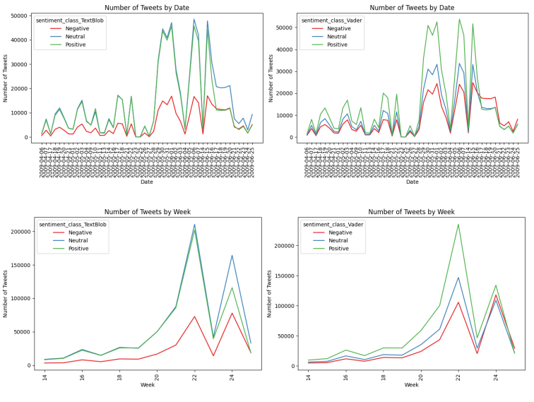
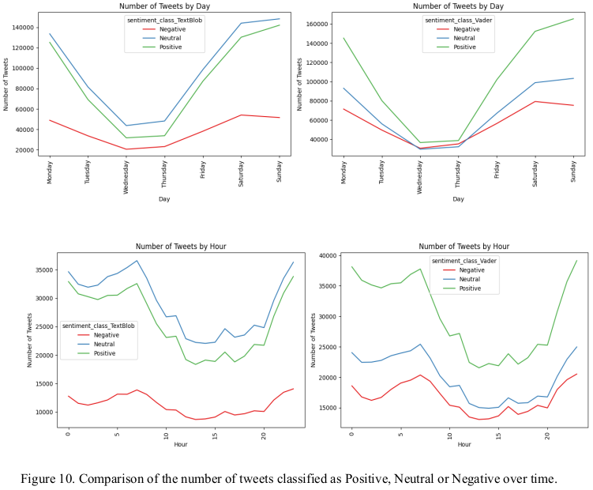
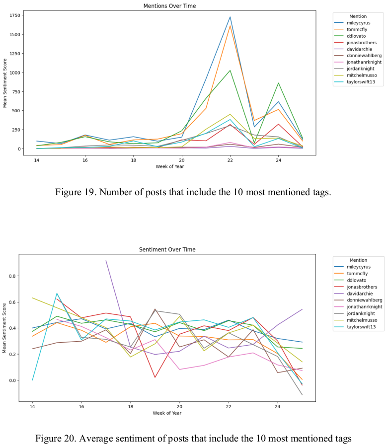
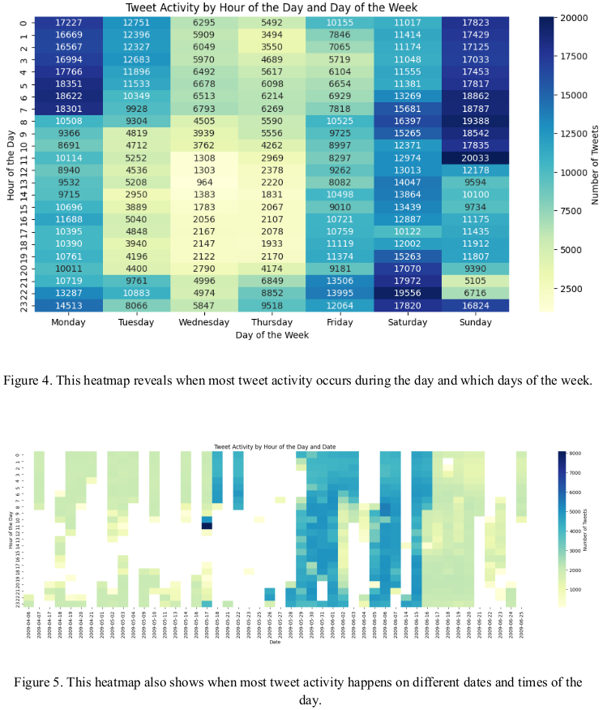
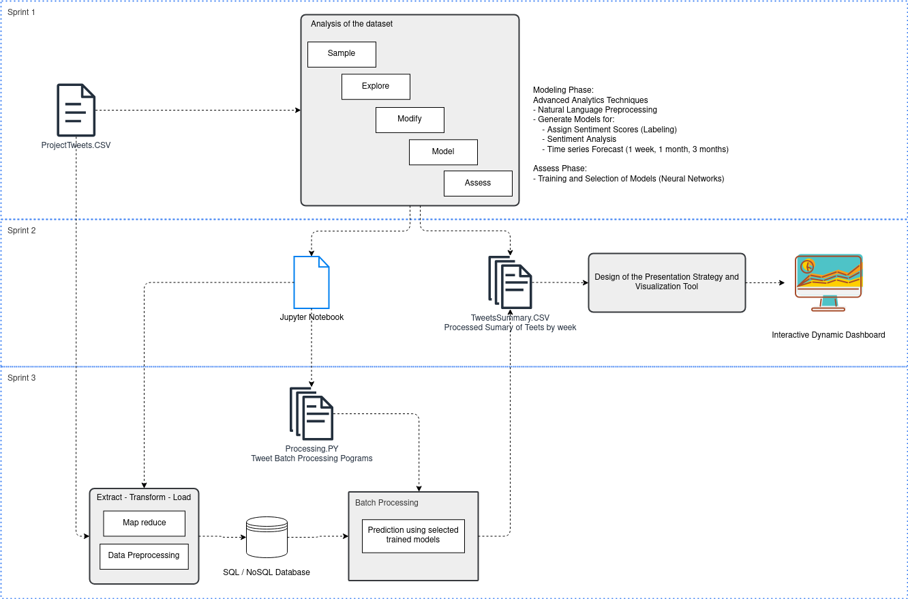

# Sentiment Analysis on Twitter Data

This project explores various methods of sentiment analysis on a dataset of Twitter posts. The objective is to compare the performance of different sentiment analysis techniques, such as lexicon-based approaches, machine learning models, and deep learning techniques. The analysis includes evaluating accuracy, precision, recall, and F1-score for each method.

The public repository of this project is available [Here](https://github.com/l-maldonado/Sentiment-Analysis-on-Twitter-Data )

## Table of Contents

1. [Introduction](#introduction)
2. [Dataset](#dataset)
3. [Methods](#methods)
   - [Lexicon-based Analysis](#lexicon-based-analysis)
   - [Machine Learning Models](#machine-learning-models)
   - [Deep Learning Models](#deep-learning-models)
4. [Evaluation Metrics](#evaluation-metrics)
5. [Project Structure](#project-structure)
6. [Results](#results)
7. [Conclusion](#conclusion)
8. [License](#license)

---

## Introduction

Sentiment analysis is a crucial technique in natural language processing (NLP) used to determine the sentiment or emotional tone of a piece of text. This project focuses on analyzing Twitter data to classify tweets as positive, negative, or neutral. Several sentiment analysis techniques are implemented and compared to identify the most effective approach for this specific dataset.

This project is structured into three modules: Advanced Data Analytics, Presentation and Visualization, and Big Data Storage and Processing. The aim is to analyze Twitter data, perform sentiment analysis, visualize trends, and build predictive models.

---

## Dataset

The dataset used for this project consists of tweets produced over a fixed period of time and gathered using the Twitter API. It includes information such as tweet text, user details, and timestamp. The data is preprocessed to remove irrelevant content like URLs, mentions, and hashtags, and is then used for sentiment classification tasks.

---

## Methods

### Lexicon-based Analysis

- **Overview**: This method uses predefined lists of words (positive and negative) to determine sentiment. The sentiment of a tweet is computed based on the frequency and intensity of the words that match the lexicon.
- **Tools/Techniques**: VADER, TextBlob

### Machine Learning Models

- **Overview**: Machine learning models such as Logistic Regression, Naive Bayes, and Support Vector Machines (SVM) are trained on labeled tweet data to classify sentiments.
- **Tools/Techniques**: Scikit-learn, TF-IDF Vectorizer

### Deep Learning Models

- **Overview**: Deep learning techniques, particularly Recurrent Neural Networks (RNNs) and Long Short-Term Memory (LSTM) networks, are employed to capture more complex patterns in text data.
- **Tools/Techniques**: Keras, TensorFlow, LSTM, Word2Vec or GloVe embeddings

---

## Evaluation Metrics

The following metrics are used to evaluate and compare the sentiment analysis methods:

- **Accuracy**: Proportion of correctly predicted sentiments.
- **Precision**: Proportion of positive predictions that are actually positive.
- **Recall**: Proportion of actual positive cases that are correctly predicted.
- **F1-score**: The harmonic mean of precision and recall.

---

## Project Structure

    /sentiment-analysis-project
    ├── /data
    │ ├── ProjectTweets.csv         # Raw Twitter dataset
    │ ├── ProjectTweets (1).csv     # Cleaned dataset
    │ ├── ProjectTweets (2).csv     # NLP labeled tokenized indexed dataset
    │ ├── positive-words.txt        # English labeling words dataset
    │ ├── negative-words.txt        # English labeling words dataset
    ├── /images
    │ ├── Twitter Project - Structure.drawio.png
    │ ├── Presentation poster.jpg
    │ ├── Misc plots
    ├── /notebooks                  # Jupyter notebook for analysis and visualizations
    │ ├── Twitter Data Mining and Sentiment Analysis - Part 1 Cleaning and EDA.ipynb
    │ ├── Twitter Data Mining and Sentiment Analysis - Part 2 NLP Processing and Visualization.ipynb
    │ ├── Twitter Data Mining and Sentiment Analysis - Part 3 Apply Assess and Compare Models.ipynb
    │ ├── Twitter Data Mining and Sentiment Analysis - Part 4 Big Data Analytics Notebook.ipynb
    ├── /src
    │ ├── preprocess.py             # Data preprocessing scripts
    │ ├── lexicon_analysis.py       # Lexicon-based sentiment analysis
    │ ├── ml_model.py               # Machine learning sentiment analysis model
    │ ├── dl_model.py               # Deep learning sentiment analysis model
    ├── FINAL REPORT_Twitter Data Mining and Sentiment Analysis.pdf
    ├── README.md                   # Project documentation
    ├── requirements.txt            # Python dependencies
    ├── LICENSE.md                  # Project licencing

---

### Research Questions

- Sentiment Trends: What are the prevailing sentiment trends in tweets related to a specific topic, and how have they evolved over time?
- Influential Users: Can we identify the most influential users based on tweet engagement?
- Topic Clustering: Are there distinct patterns in tweet topics, and what factors contribute to their emergence?
- Sentiment Evolution: How do sentiments change over time for the dataset?

### Project Stages

**Module 1:** Data Cleaning and Exploratory Data Analysis

- Data Preprocessing:
  Load and clean the dataset (ProjectTweets.csv), Identify data types, handling missing data and irrelevant columns.
  Data Cleaning: Address null values and remove duplicate rows. Standardize date-time columns for analysis.
  Text Preprocessing: Convert text to lowercase, remove special characters,
  Exploratory Data Analysis (EDA): Group data by time periods (e.g., day, month, hour), including summary statistics and visualizations to identify patterns.

**Module 2:** NLP Processing, Presentation and Visualization

- Data Processing and Analysis Steps
  Text Processing: Clean text by removing URLs, hashtags, user mentions, stop words, and punctuation.

  Apply tokenization, stemming, and lemmatization.

  Feature Engineering: Convert text data into a numerical form using Bag-of-Words or CountVectorizer from the scikit-learn library.

- Sentiment Analysis:
  Labeling and Classification: Use techniques like Bag-of-Words for sentiment classification and compare with pre-trained models.

  Sentiment Analysis: Apply libraries like NLTK, TextBlob, and VADER which provide sentiment polarity and compound scores, respectively. We classify tweets into Positive, Neutral, or Negative categories.

  Compare sentiment scores over time using different techniques (TextBlob vs. VADER).

  
  

- Visualizations and Trends
  Frequency of Sentiment:
  Histogram and Boxplot: Visualize the distribution of sentiment scores with bar charts, box plots, and histograms.
  Time-based Sentiment: Analyze and visualize sentiment trends over different time periods (hour, day, week, month).

  Trending Topics:
  Create word clouds for positive, neutral, and negative tweets.
  Plot the most common hashtags and mentions to identify trending topics and their associated sentiment.

  Hashtag and Mention Frequency:
  Analyze the frequency of hashtags and mentions over time.
  Use bar charts to show the most frequently mentioned users, hashtags, and their sentiment associations.

Heatmaps:
Generate heatmaps to visualize the variation in sentiment over different days and times.
Create bar charts to visualize the most frequent hashtags and mentions in the tweets.
Use heatmaps to show sentiment distribution across different times of the day.

**Module 3:** Compare Models

- Vectorization:
  The textual data is transformed into sparse matrices using CountVectorizer and TfidfVectorizer, which help in converting tweet text into feature vectors for model input. We apply n-grams and limit the number of features to manage model complexity and efficiency.

- Data Splitting:
  The dataset is divided into training, validation, and testing subsets. The training set is used to build models, the validation set is used for hyperparameter tuning, and the test set is used to assess final model performance.

- Model Training:
  Several machine learning models are applied to predict sentiment trends based on tweet text.

- Model Selection: Various classifiers are applied to test performance. These include:
  - Bernoulli Naive Bayes: This model uses the probability of each feature (word) to classify sentiments.
  - SVM (Support Vector Machine, LinearSVC): A linear classifier that finds a hyperplane that best separates the classes.
  - Logistic Regression: A model that uses a logistic function to predict sentiment class probabilities.
  - Random Forest Classifier: An ensemble method that combines multiple decision trees to improve prediction accuracy.
- Time-series analysis methods:

  - To predict future sentiment trends on time frames (1 week, 1 month, 3 months).
  - User Engagement and Influence: Scatter plots and network graphs are used to analyze user engagement (e.g., retweets, favorites) and identify influential users based on their follower counts and interactions.

- Model Evaluation:
  Metrics: Models are evaluated using accuracy, F1 score, and confusion matrix. ROC-AUC curves are also used to evaluate the models’ ability to distinguish between the sentiment classes. Heatmaps visualize the confusion matrix, showing the true positive, true negative, false positive, and false negative rates.
  Performance Comparison: Model performance is compared based on their accuracy and ROC curves. Bar charts are used to display the accuracy of different models, helping to identify the best-performing model for sentiment prediction.

**Module 4:** Big Data Storage and Processing

Having developed the analytics framework, Now we focused on collecting and analyzing Twitter data related to the hashtag #COVID-19 from April to June 2020. The goal is to perform sentiment analysis on these tweets and predict various emotional states using natural language processing (NLP) techniques. This involved handling a massive dataset of around 10 million tweets, building a distributed system to process the data efficiently, and visualizing the results on a website.

The team used Twint, a tool for scraping Twitter data without API access. They crawled around 500,000 tweets per day, totalling approximately 9.8 million tweets by project completion.

- Sentiment Analysis:

Emotion Recognition: A neural network-based emotion analyzer was built to classify tweets into six emotional categories: happy, bad, encouraged, joy, loving, and depressed. The output was a real value between 0 and 1 for each emotion.
Polarity and Subjectivity: TextBlob was used to analyze the polarity (positive/negative) and subjectivity (factual/subjective) of the tweets.
Insult Detection: A separate neural network was deployed to detect insults in the tweets using DeepPavlov.

- Data Processing:

The analysis was performed on a daily basis, with tweets resampled to minute-level granularity to track changes in emotion over time.
The processed data was stored in a data warehouse for easy access and visualization.

- Data Visualization:

The processed sentiment data was visualized in line charts, illustrating changes in emotions and insult tweets over time.
Word clouds were generated daily to capture trending topics and public sentiment.

- Data Warehouse:

The data was uploaded to two storage platforms:
OSF (Open Science Foundation): Used for storing word cloud images, making them accessible for the frontend visualizer.
GitHub: Used to store the CSV files containing the emotion data per day.

The system successfully analyzed sentiment data and tracked changes in emotional states during the pandemic. Key findings included:
Emotions remained stable overall, with a rise in positive emotions like encouragement and happiness in May and June compared to April.
Insulting tweets were rare (only 0.4% of tweets in the sample).

Cluster Performance: The project used a 4-node cluster (1 for crawling and 3 for analysis) to process the data. However, parallel processing still took longer than expected, particularly for insult detection.

### References

    [Sentiment Analysis Overview](https://www.cio.com/article/189218/what-is-sentiment-analysis-using-nlp-and-ml-to-extract-meaning.html)
    [Best Practices for Sentiment Analysis](https://www.linkedin.com/advice/0/what-some-best-practices-adapting-general-sentiment)

## Results

**Key Insights**

- The project identifies sentiment trends, compares different sentiment analysis techniques (TextBlob and VADER), and builds predictive models to forecast sentiment changes over time. However, the dataset is not labeled and the conclusions can be misleading

- Visualizations reveal the emotional tone of tweets over time, providing insights into user engagement and the most discussed topics. The analysis of tweet volume and sentiment helps identify prevailing sentiment trends.

- Predictive models built on machine learning techniques allow for forecasting sentiment trends at 1-week, 1-month, and 3-month intervals, offering insights into future Twitter sentiment, however, it is difficult to assert its accuracy yet.

## Conclusion

This project provides a framework to attack an analytics project based in text using different NLP techniques. We get some insight into the effectiveness of different sentiment analysis methods applied to Twitter data.

The comparison results show how traditional lexicon-based methods fare against modern machine learning and deep learning techniques. It helps determine the most effective methods for this kind of analysis, but is inconclusive about how acccurate are the predictions and hw trustful are the insight.

## License

All rights reserved

No Use Without Permission

No Commercial Use

Modification Prohibited

Attribution must be made

See the [LICENSE](LICENSE.md) file for details.

---
